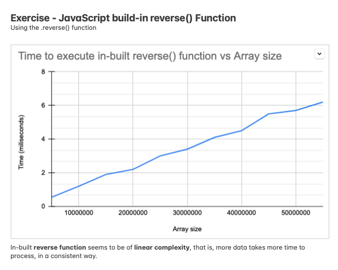
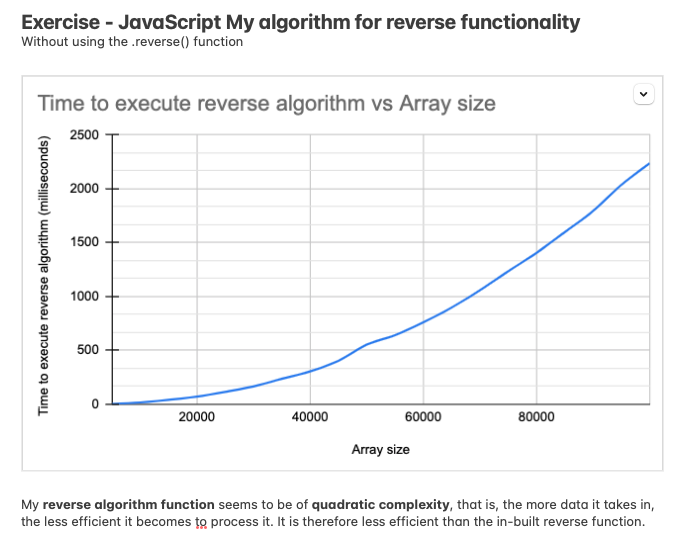
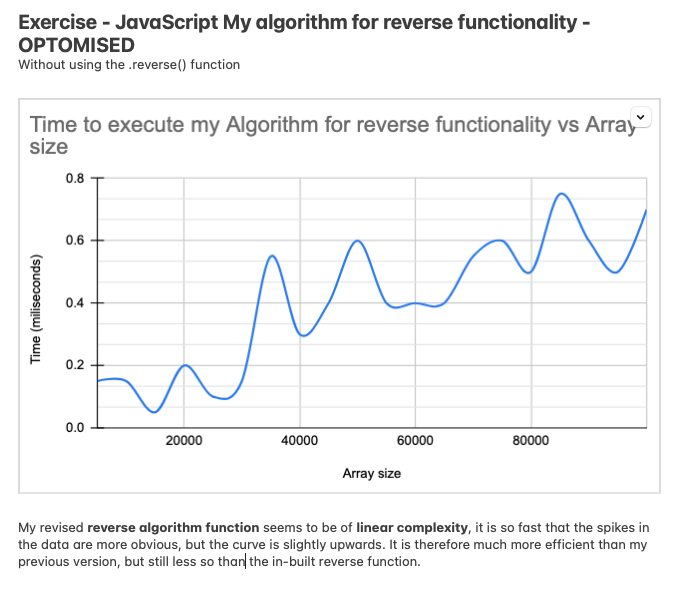
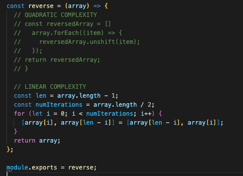

# Algorithmic Complexity

### Timing code

To start, let's look at how fast some standard library functions run. 
* example: `reverse`

- [ ] Create some code that returns the time needed to execute a function.
- [ ] What if you make the array passed into the functions 10, 100, 1000, 10000 times bigger?
- [ ] Create graphs to compare different pieces of code. You will transform your code into a _timing framework_. It should:
  - Create arrays of different sizes (try 5000 to 100<nbsp>000 in steps of 5000)
  - Run the code to time on each
  - Print the size and corresponding time.
- [ ] From there, you should use a spreadsheet utility to plot the results into a curve (time spent over input size).

### Build your own algorithms

Now, let's look at efficiency for our own algorithms.
For now, we are not concerned with making them efficient.

For each algorithm you write, you should:
- [ ] Write a few tests (covering different cases)
- [ ] Implement them
- [ ] Run your timing framework
- [ ] Plot their curves

Once you have written a few, compare the shapes of different curves.
- [ ] How can you characterise the complexity of different algorithms?
- [ ] Which algorithms are more efficient?

